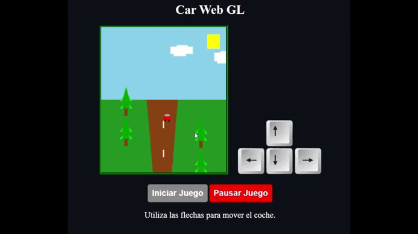
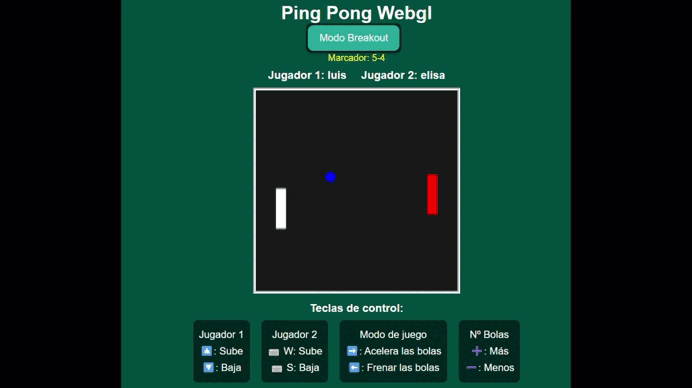
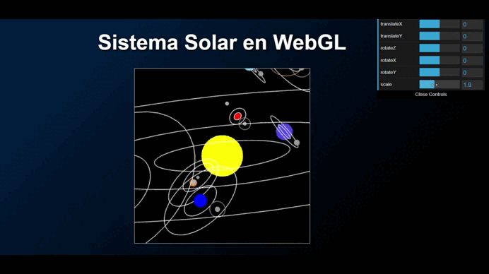

# Colección de Juegos WebGL

Este repositorio contiene varios mini-juegos desarrollados con **WebGL 2.0**, usando HTML, CSS y JavaScript puro.
Cada juego está diseñado para ejecutarse directamente en el navegador, sin necesidad de frameworks externos.

## 🚗 Juego 1: **Car WebGL**

**Car WebGL** es un juego simple en el que controlas un coche desde una vista frontal en una carretera. El entorno incluye árboles, nubes y una carretera animada que simula movimiento. El objetivo es **mover el coche libremente** usando las teclas de flecha, evitando salir del camino mientras el escenario se desplaza. Pruebalo -> [Link del juego](https://alejandrodavidarzolasaavedra.github.io/webgl/car_game/)

  

## 🏓 Juego 2: Ping Pong WebGL

Ping Pong WebGL es un juego de tenis de mesa interactivo en 2D creado con WebGL 2.0. El juego también permite personalizar el nombre y color de cada jugador antes de comenzar.  Pruebalo -> [Link del juego](https://alejandrodavidarzolasaavedra.github.io/webgl/ping_pong/)

Permite jugar dos modos de juego:

- Modo Normal → Dos jugadores compiten para alcanzar 10 puntos.
- Modo Breakout → Un solo jugador destruye bloques con la pelota, al estilo “Arkanoid”.

  

## ☀️ Juego 3: Sistema Solar WebGL

Sistema Solar WebGL es una simulación interactiva que muestra el movimiento de los planetas alrededor del Sol. Cada planeta tiene su propio color, tamaño, órbita y, en algunos casos, lunas y anillos. El sistema se representa en un entorno 2D con animaciones continuas y efectos visuales suaves. Pruebalo -> [Link del juego](https://alejandrodavidarzolasaavedra.github.io/webgl/solar_system/)

  

